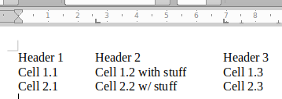
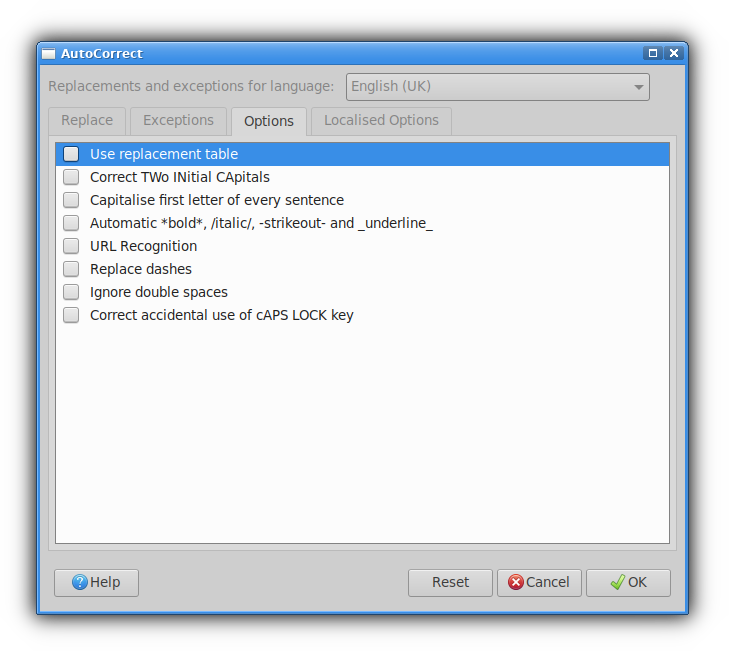
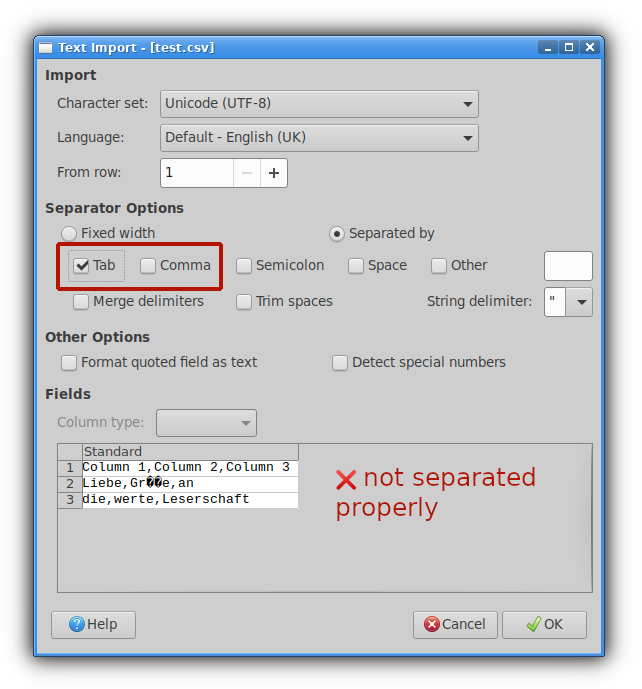
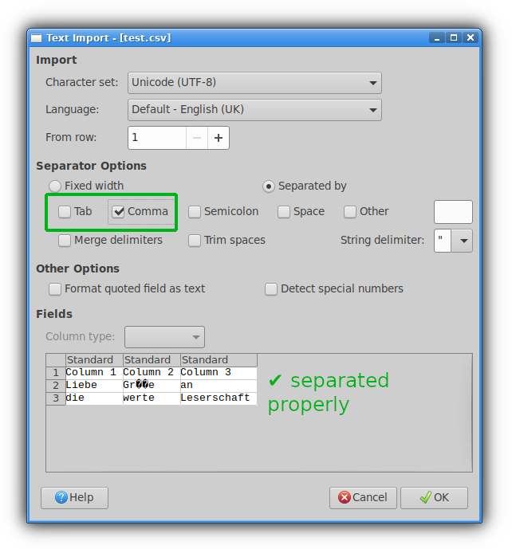
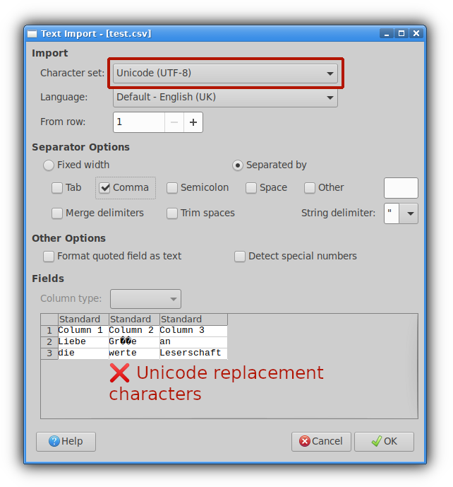
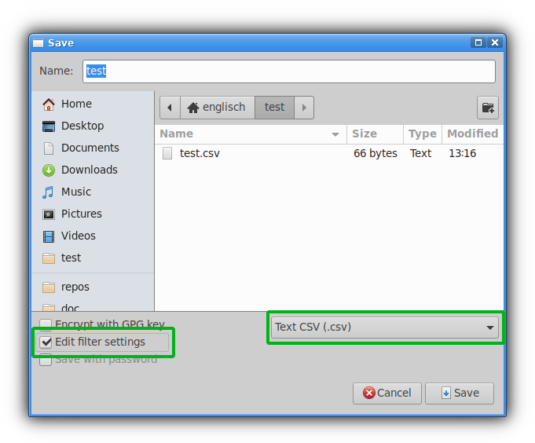
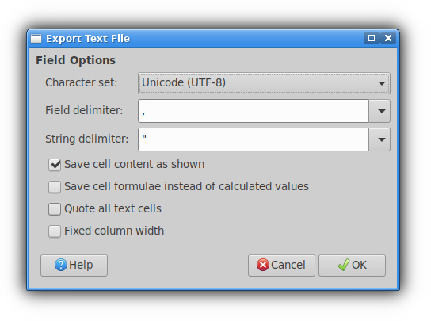

CSV and TSV:  Tabular data in plain text
========================================

Introduction
------------

CSV and TSV are text-based data formats used to store and transfer tables.  We
like these formats because:

 * They're common and well-understood.
 * They're easy to understand for human beings.
 * They're easy to parse with computer programs.
 * Your favourite spreadsheet program can import and export them 
   \*cough\*excelisnotyourfavouritespreadsheetprogram\*cough\*
 * Your favourite programming language has a library that can read and write
   them.
 * They lend themselves (somewhat) well to [revision control systems like git](./git.md).

*Prerequisites:*
Since CSV and TSV are plain-text formats it might be a good idea to first read
and understand the tutorial on
[how plain-text and character encodings work](./text-and-encodings.md).

How CSV files work
------------------

CSV stands for _**C**omma-**S**eparated **V**alues_, which describes the format
pretty well.  A CSV file is a text file that contains exactly one table.  Each
line in that text file is a row in the table.  The cells of each table are
separated using commas.  The result looks like this:

    Header 1,Header 2,Header 3
    Cell 1.1,Cell 1.2,Cell 1.3
    Cell 2.1,Cell 2.2,Cell 2.3

Also, it is possible to put double quotes `"` around cells.  When cells are
quoted they can also contain commas and line breaks themselves, which is quite
useful.  Also, if you want to put quotes inside of your quoted cells, you can do
so by putting in two quotation marks in a row.  Some examples:

    Header 1,Header 2,Header 3
    Cell 1.1,"Cell 1.2 (quoted just for the heck of it)",Cell 1.3
    Cell 2.1,"Cell 2.2 (quoted, with a comma)",Cell 2.3
    Cell 3.1,"Cell 3.2 (with a
    newline)",Cell 3.3
    Cell 4.1,"Cell 4.2 (containing ""quotes"")",Cell 4.3

And that's all there's to it.

How TSV files work
------------------

TSV files are a very similar file format to CSV.  TSV stands for
_**T**ab-**S**eparated **V**alues_.  As the name suggests, this format uses *tab
characters* to separate the cells within each line:

    Header 1<tab>Header 2<tab>Header 3
    Cell 1.1<tab>Cell 1.2<tab>Cell 1.3
    Cell 2.1<tab>Cell 2.2<tab>Cell 2.3

Now, what is a tab character?  A *tab* (code point `9` in both ASCII and
Unicode) is a white space character that represents the tabulator key on your
keyboard.  It moves the following text to the right so it aligns with some kind
of imaginary vertical line.  Where that line is?  Well that is entirely up to
the program that displays the text…  So, as an example, look at the following
TSV table, where I replaced the `<tab>` place holder with actual tab characters:

    Header 1	Header 2	Header 3
    Cell 1.1	Cell 1.2 with stuff	Cell 1.3
    Cell 2.1	Cell 2.2 w/ stuff	Cell 2.3

I literally cannot tell you what you are seeing right now:

 * If you look at the rendered version on GitHub, their webpage will just put
   the imaginary tab lines wherever it wants.
 * If you look at the Markdown version of this file in a text editor, you can
   configure the tab width in its config file/settings menu.  Many text editors
   default to a tab every 4 or 8 characters.
 * If you copy-paste the text into a Word Processor like LibreOffice, you can
   use the ruler at the top to put the tabs wherever you want them to be… 
   

But I do have some guesses of what you might see:

 * There is a good chance all the cells in column 2 line up with each other
   rather nicely.
 * There is a good chance the cells in column 3 don't all line up – because some
   of the cells go over the ‘imaginary line’ and push everything back.
 * There is a chance that `Cell 1.3` and `Cell 2.3` *do* line up with each
   other.

It's actually not very common to find tabs inside of regular text (outside of
program code) – instead they're usually used to separate bits of text
from each other, which is precisely what TSV files do.

Because tabs aren't actually supposed to be used in text, the TSV standard
(technically) does not allow quoting and instead requires tabs and newline to be
replaced with escape sequences like `\t` or `\n`.

Differences between CSV and TSV
-------------------------------

### In theory

While the TSV and CSV formats are very very similar, they are actually separate
formats defined in separate standards:

 * CSV: [RFC 4180][csv-std]
 * TSV: [IANA MIME type][tsv-std]

[csv-std]: https://datatracker.ietf.org/doc/html/rfc4180
[tsv-std]: https://www.iana.org/assignments/media-types/text/tab-separated-values

Aside from the choice of separator there are a few details that are different
between the standards:

 * CSV allows quoting, TSV doesn't.
 * TSV requires the first row to contain the names for all columns, CSV doesn't.
 * CSV requires CRLF line endings to be used, the TSV standard does not mention
   any line ending scheme explicitly.
 * The TSV standard explicitly mentions that all rows must have the same number
   of cells.

### In practice

All bets are off…

Basically, the two standards are just summaries of practices that a disjointed
cloud of people across the internet had already been using.  And out in the
field people parse and generate all sorts of data.  Some implementations choke
if there are rows of different sizes, others just deal with it.  Some
implementations don't allow quoting.  Some allow CSV files with semicolons
instead of commas.  I vaguely remember there are even programs that generate
comma-separated values if it's set to English and semicolon-separated values if
it's set to a language like German, which uses commas in place of decimal points
(e.g. 3,141592653589793).

Also, a lot of implementations also don't treat the two standards as separate
and just treat TSV as ‘CSV with tabs instead of commas’.  Others might make
a difference, though – who knows…

Best practices for working with CSV/TSV files
---------------------------------------------

### When editing spreadsheets in general

 * It's generally a good idea use the first row of the table for column names
   – any workflow that requires people to remember or guess what the data was
   supposed to be is doomed to fall apart eventually…

 * Avoid typographic quotes (`‘’`, `“”`, `„“`, etc.) in your table.  While they
   pose no problem for the computer (they're separate Unicode code points after
   all), they make life more confusing for human beings, whenever they have to
   look at the raw data.

 * Keep backups of all files before making significant changes 
   (bonus points for using revision control).

 * Double- and triple-check that the character encoding isn't broken when
   importing or exporting CSV/TSV.

### When generating CSV/TSV files

If you're writing code that generates tabular data (no matter whether it's in
Python, or R, or whatever) it is a good idea to follow these guidelines:

 * Stick to the standards as closely as you can.

 * Make sure all rows have the same width.

 * Don't generate empty rows or empty columns.

### When reading CSV/TSV files

If you're writing code that reads tabular data there are also guidelines you
should keep in mind:

 * Don't assume anyone adheres to any standards…

 * Make sure your program can handle trailing or missing cells…

 * Don't assume empty rows or empty columns mark the end of a spreadsheet…

A quick note on Microsoft Excel
-------------------------------

I hear it is possible to work with CSV data in Excel but I haven't met anyone
who's actually managed to do it…  People seem to struggle with the UI a lot.
Importing CSV seems to be somewhat reliable once you figured out how to do it,
but exporting seems to be a problem.  Sometimes the format isn't right,
sometimes the character encoding isn't right.

Currently most people just walk the path of least resistance and switch to
LibreOffice Calc instead.  It can be a bit janky at times, but at least it
works.

(Side note:  I never used the Numbers program by Apple, so I don't know if it's
any good or not.)

Working with CSV and TSV files in LibreOffice Calc
--------------------------------------------------

### Recommendation: Turn off auto-correction features

By default LibreOffice enables a lot of features that automatically correct
common user mistakes – stuff like replacing quotations marks and hyphens with
typographically more pleasing alternatives (`“”`, `–`), switching letters from
lower-case to upper-case or back, and so forth.

While these features were made with the best of intentions, they can get in the
way when working with research data, where stuff like capitalisation is
important.  Because of that it's recommended to open the auto-correction options
under `Tools → AutoCorrect Options…` and turn off all the things.

### Importing TSV/CSV data into LibreOffice Calc

The easiest way to import a TSV/CSV file is to just open the file in LibreOffice
Calc (either from your file manager or by using *File → Open* in the menu bar.

This will open the import dialogue where you can tell LibreOffice about the
format of the file.  It also comes with a small preview where you can
double-check the effects of your settings.  There are two things to look out
for: the *separator* and the *encoding*.

First make sure you set the correct separator for your data (commas for CSV,
tabs for TSV):

 * If the separator is wrong, the table in the preview won't line up
   properly. 
   
 * If the separator is correct, the table in the preview will look as
   intended. 
   

Then you need to make sure the character encoding is right.  In a perfect world
all files would use some sort of Unicode encoding (UTF-8, UTF-16, etc.),
*however* when reading files that other people have made, you have to work with
the world you have, not the one you want.

The only real way to figure out the character encoding of a file is to scroll
the small preview to a place where there is some sort of non-English text or
some special character (`–`, `“”`, `😐`, `…`, etc.) and then experiment with
different encodings until it looks right.

 * If the table contains text that cannot be decoded with the selected encoding
   it will be replaced with placeholder characters. 
   
 * If the text can be decoded using different encodings, them some of them will
   just produce wrong results. 
   
 * Try to switch encodings until all the non-English text looks like you expect
   it to. 
   

### Exporting a spreadsheet to CSV/TSV from LibreOffice Calc

To export a spreadsheet to CSV/TSV data you can just use the *Save as…* dialogue
in LibreOffice:

 1. Set the file type to *Text CSV (.csv)* (regardless whether you want to save
    you data as CSV or TSV).
 2. Check the *Edit filter settings* checkbox.

This should open a second dialogue where you can set the details about your
output:

 1. *Character set*:  Set this to the character encoding you want the file to be
    saved as.  When unsure, *Unicode (UTF-8)* is always a good bet.
 2. *Field delimiter*:  Set this to `,` for CSV or to `{Tab}` for TSV.

*Note:*
LibreOffice will give always the file the file extension `.csv`, no matter if
you're saving CSV or TSV data.  If you're saving TSV data, it is recommended to
go into your file manager and rename the file from `.csv` to `.tsv` after
exporting it.

<!-- TODO: csvkit (https://csvkit.readthedocs.io/en/latest/) -->
<!-- TODO: Python -->
